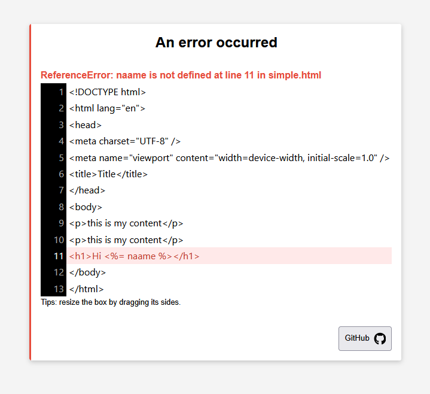
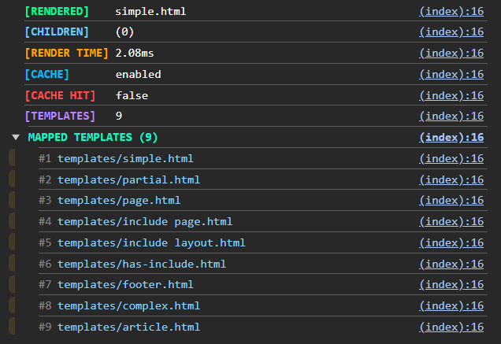
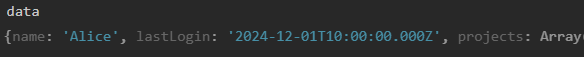

## Node Tao

<p align="center">
  
</p>

**`TAO`** is a simple, lightweight and very fast embedded JS templating. It emphasizes great performance, security, and developer experience.

### 🌟 Features

- 🚀 Super Fast
- 🔧 Configurable
- 🔥 Caching
- ⚡️ Support for partials
- 📝 Easy template syntax (no prefix needed)
- 💻 Developer experience
- 🧩 Support for local and global helpers
- 🛡️ Security by design

## Get Started

Define a template `simple.html` inside a view directory `templates`

```html
<!-- templates/simple.html -->
<h1>Hi <%= name %>!</h1>
```

```javascript
import { Tao } from 'tao';

const tao = new Tao({ views: path.join(__dirname, 'templates') });

const res = tao.render('simple', { name: 'Tao' });
console.log(res); // <h1>Hi Tao!</h1>
```

## Helpers

Helpers are functions that can be used inside a template. Helpers can be **local** (only available in a particular `render`) or **global** (available everywhere on the instance).

```javascript
import { Tao } from 'tao';

const tao = new Tao({ views: path.join(__dirname, 'templates') });

// Global helper
function nPlusTwo(n: number) {
  return n + 2;
}
// Global helper need to be registered on the instance
tao.defineHelpers({ nPlusTwo });

// Render a template
app.get('/', (req, res) => {
  // Local helper
  function nPlusOne(n: number) {
    return n + 1;
  }

  const res = tao.render('simple', { name: 'Ben' }, { nPlusOne });
  console.log(res); // <h1>Hi Ben!</h1>
});
```

It is also possible to register helpers on `globalThis` without provide them to the template engine, but it can lead to name collision.

## Include

In your template, you might want to include other templates:

```html
<h1>Hi <%= name %>!</h1>
<%~ include('article', { phone: 'Tao T9' }) %>
```

Child components will inherit from **data** and **helpers** provided in the parent component.

## Template prefix options

There are three differents template prefixes:

```html
<!-- Evaluation (''): no escape (ideal for js execution) -->
<% const age = 33; %>
<!-- Interpolation (=): escaping (ideal for data interpolation) -->
<p><%= `Age: ${age}` %></p>
<!-- Raw (~): no escape (ideal for HTML inclusion) -->
<%~ include('product') %>
```

NB: _Those prefix are configurable in the options._

## Template paths resolution

`TAO` will _recursively_ add all templates matching the containing `views` path definition

```javascript
import { Tao } from 'tao';

const tao = new Tao({ views: path.join(__dirname, 'templates') });
```

...such that following structure is ok :

```
| /templates
|   - simple.html         ✔️
|   /products
|     - article.html      ✔️
|     /...
|       - nested.html     ✔️
```

By default, `fileResolution` is set to `flexible`, which means that you can just provide the _unique end of the path_:

```javascript
const res = tao.render('nested'); // accepted ✔️
const res = tao.render('products/.../nested'); // not necessary ❌
```

`TAO` will successfully identify the nested templates without providing the subfolder(s).

## Programmatically defined templates

You might want to define programmatically templates:

```javascript
const headerPartial = `
  <header>
    <h1><%= title %></h1>
  </header>
`;

tao.loadTemplate('@header', headerPartial);
const rendered = tao.render('@header', { title: 'Computer shop' });
```

## Cache Storage

`TAO` uses cache stores to manage caching. You might want to interact with those stores to retrieve or delete an entry:

```javascript
tao.helpersStore.remove('myHelperFn');
```

## Security by design

By default, `TAO` assume you are running your app in production, so no error will be thrown, such that error stack traces are not visible in your browser. Errors will be displayed in your editor console, and visual error representation (see developer experience) is available in your browser by setting `debug: true` at option initialisation.

## Developer experience

All methods, properties are correctly typed and documented, so you should get help from your editor.

In case of an error, a visual representation is available in your browser, giving you all the details and the precise line of the error (if available).



NB: _set `debug: true` to activate this option. Do not activate this option in production._

Metrics are also available, so you get usefull informations about the template rendering time, cache hit, mapped templates, etc. in your browser console.



If you want to inspect the data provided to the template, it is available directly in your browser console under the object `data`.



NB: _set `metrics: true` to activate this option. Do not activate this option in production._

## FAQs

<details>
  <summary>
    <b>Some words about this library</b>
  </summary>

It started as a fork of `eta`, but became a dedicated library because the changes made were too significant. Some parts are still based on `eta`, especially the template parsing, and if you know `eta`, the API will be familiar.

</details>

<details>
  <summary>
    <b>If you want to compare tao with eta</b>
  </summary>

- **Tao set security by design**: Stack traces are not visible in the browser. Increased security in files mapping.
- **Increased developer experience**: Visual error representation, metrics, configuration options are checked.
- **Immutability**: Data provided in the template is immutable, ie. template data modification does not affect original data.
- **Clearer API**: Scope is well defined and restricted, which also improves security. Clean code practices are enforced.
- **Clearer template syntax**: No prefix are needed.
- **Helpers**: Global and local helpers, which are clearer and more suitable for little template logic.
- **Flexible template path resolution**: With `fileResolution` mode set to `flexible`, only end unique paths can be provided, which increases file path readability (aka. `namespaces`).
- **Performance**: Various performance optimization.

</details>

<details>
  <summary>
    <b>Choices</b>
  </summary>

- **No async support**: Supporting async rendering (e.g., `await include`) within templates encourages placing too much logic in the view layer and can be considered as an _anti-pattern_. Templates should be responsible for displaying data, while controllers should handle logic. Async behavior in templates would also require error handling (e.g., `try/catch`), adding complexity. Logic in templates is difficult to test, debug, and hard to read. In short: if you have async data, fetch it beforehand and render it synchronously.

- **No `layouts`**: Layouts are essentially includes and add unnecessary complexity to the rendering process.

- **No `rmWhitespace`**: Stripping whitespace at the template level yields negligible HTML size savings. Using compression (e.g., via Nginx or other proxies) is far more effective and scalable.

_If you think those features are absolutely necessary, please open a new discussion on github and provide an example._

</details>

<br />

## Change logs

## Credits

- Syntax and some parts of compilation are based on `eta`.
